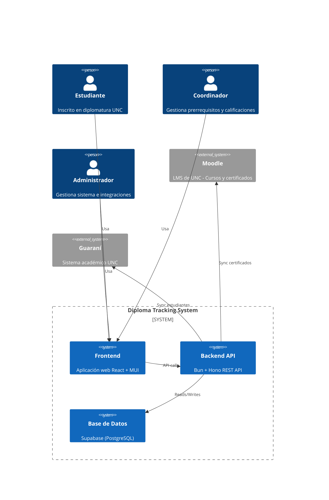
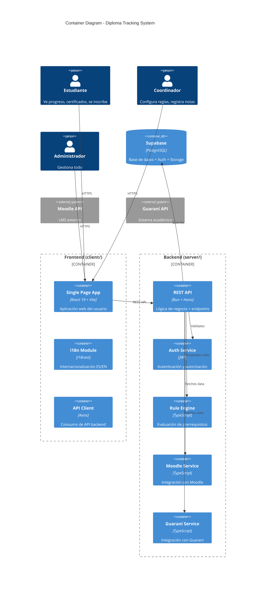
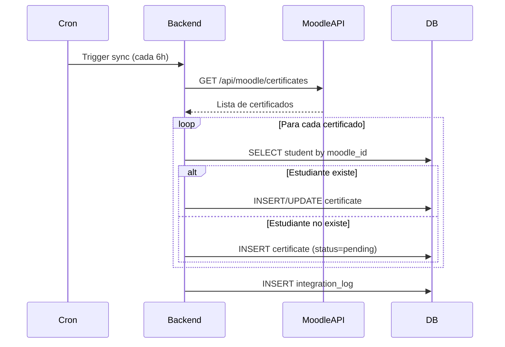
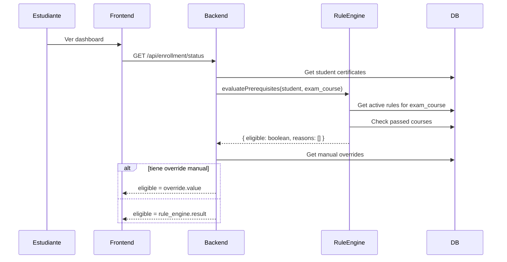

# Architecture Specifications - Diploma Tracking System

> Generated from: `.prompts/fase-2-architecture/srs-architecture-specs.md`
> Based on: MVP Scope + Tech Stack (Bun + Hono + React + Supabase)

---

## 1. System Context (C4 Level 1)



---

## 2. Container Architecture (C4 Level 2)



---

## 3. Entity Relationship Diagram (ERD)

```mermaid
erDiagram
    STUDENT ||--o{ ENROLLMENT : has
    STUDENT ||--o{ CERTIFICATE : earns
    STUDENT ||--o{ MANUAL_OVERRIDE : has
    STUDENT {
        uuid id PK
        string guarani_id UK
        string name
        string email
        string dni UK
        string role "estudiante|coordinador|admin|sysadmin"
        boolean is_active
        timestamp created_at
        timestamp updated_at
    }
    
    TRACK ||--o{ COURSE : contains
    TRACK ||--o{ ENROLLMENT : tracks
    TRACK {
        uuid id PK
        string name
        string code UK
        text description
        int credits_required
        boolean is_active
        timestamp created_at
    }
    
    COURSE ||--o{ CERTIFICATE : generates
    COURSE ||--o{ ENROLLMENT : enrolls_in
    COURSE ||--o{ PREREQUISITE_RULE : is_prerequisite_of
    COURSE {
        uuid id PK
        string name
        string code UK
        int credits
        string moodle_course_id
        boolean is_integrator_exam
        boolean is_active
        timestamp created_at
    }
    
    ENROLLMENT {
        uuid id PK
        uuid student_id FK
        uuid course_id FK
        uuid track_id FK
        enum status "pending|in_progress|completed"
        date enrollment_date
        date completion_date
        float qualification
        text observations
        timestamp created_at
    }
    
    CERTIFICATE {
        uuid id PK
        uuid student_id FK
        uuid course_id FK
        string moodle_certificate_id UK
        date issue_date
        string status "approved|pending|rejected"
        float qualification
        boolean is_valid
        timestamp created_at
    }
    
    PREREQUISITE_RULE ||--o{ COURSE : applies_to
    PREREQUISITE_RULE {
        uuid id PK
        uuid target_course_id FK
        string condition "ALL|ANY"
        boolean is_active
        string created_by
        timestamp created_at
    }
    
    PREREQUISITE_RULE ||--o{ PREREQUISITE_SOURCE : has_sources
    PREREQUISITE_SOURCE {
        uuid rule_id FK
        uuid source_course_id FK
        PK composite(rule_id, source_course_id)
    }
    
    MANUAL_OVERRIDE {
        uuid id PK
        uuid student_id FK
        uuid course_id FK "nullable (null = toda la diplomatura)"
        string action "enable|disable"
        string reason "requerido"
        string created_by
        timestamp created_at
    }
    
    INTEGRATION_LOG {
        uuid id PK
        string integration_type "moodle|guarani"
        string operation "sync|fetch|push"
        string status "success|error|pending"
        text message
        jsonb details
        timestamp created_at
    }
```

---

## 4. Data Flow Diagrams

### 4.1 Sync de Certificados Moodle



### 4.2 Evaluación de Habilitación



---

## 5. Tech Stack

### 5.1 Frontend

| Component | Technology | Version | Justification |
|-----------|------------|---------|---------------|
| Framework | React | 19 | Template standard |
| Bundler | Vite | 6.x | Fast HMR, moderno |
| UI Library | MUI | 7.x | Componentes admin listos |
| i18n | i18next | 23.x | Template recommended |
| HTTP Client | Axios | 1.x | Interceptors, typed |
| State | Zustand | 5.x | Lightweight, simple |
| Routing | React Router | 7.x | SPA routing |

### 5.2 Backend

| Component | Technology | Version | Justification |
|-----------|------------|---------|---------------|
| Runtime | Bun | 1.x | Template standard |
| Framework | Hono | 4.x | Lightweight, Bun native |
| Auth | JWT (jose) | 5.x | Standard, RS256 |
| ORM | Supabase JS | 2.x | PostgreSQL + auto-types |
| Validation | Zod | 3.x | Schema validation |
| Logger | pino | 9.x | Structured logging |

### 5.3 Database

| Component | Technology | Notes |
|-----------|------------|-------|
| Database | Supabase (PostgreSQL 15) | Cloud, RLS, auto-APIs |
| Auth | Supabase Auth | email + future SSO |
| Storage | Supabase Storage | Diplomas PDF (placeholder) |

---

## 6. API Structure

### 6.1 Route Groups

```
/api/v1/
├── /auth
│   ├── POST /login
│   ├── POST /refresh
│   └── POST /logout
├── /students
│   ├── GET /              (admin)
│   ├── GET /:id           (own or admin)
│   ├── GET /:id/progress  (own or admin)
│   └── GET /:id/certificates
├── /courses
│   ├── GET /
│   ├── GET /:id
│   └── GET /:id/prerequisites
├── /certificates
│   ├── GET /
│   ├── GET /:id
│   └── POST /sync         (admin, trigger Moodle sync)
├── /enrollments
│   ├── GET /
│   ├── POST /            (estudiante)
│   ├── PUT /:id/grade    (coordinador)
│   └── GET /eligibility/:studentId
├── /rules
│   ├── GET /
│   ├── POST /
│   ├── PUT /:id
│   └── DELETE /:id
├── /diploma
│   ├── GET /status/:studentId
│   ├── POST /enroll
│   └── POST /register-grade
├── /integrations
│   ├── GET /status
│   ├── POST /sync/moodle
│   ├── POST /sync/guarani
│   └── GET /logs
└── /admin
    ├── GET /dashboard-stats
    └── GET /students
```

### 6.2 OpenAPI Spec

Ver archivo: `.context/SRS/api-contracts.yaml`

---

## 7. Environment Variables

### 7.1 Backend (.env)

```bash
# Supabase
SUPABASE_URL=https://xxx.supabase.co
SUPABASE_ANON_KEY=eyJ...
SUPABASE_SERVICE_ROLE_KEY=eyJ...

# JWT
JWT_SECRET=your-secret-key-min-32-chars
JWT_EXPIRES_IN=24h
JWT_REFRESH_EXPIRES_IN=7d

# Integrations (placeholders)
MOODLE_API_URL=https://moodle.unc.edu.ar
MOODLE_API_TOKEN=placeholder-token
GUARANI_API_URL=https://guarani.unc.edu.ar
GUARANI_API_TOKEN=placeholder-token

# App
NODE_ENV=development
PORT=3000
CORS_ORIGIN=http://localhost:5173
```

### 7.2 Frontend (.env)

```bash
VITE_API_URL=http://localhost:3000/api/v1
VITE_SUPABASE_URL=https://xxx.supabase.co
VITE_SUPABASE_ANON_KEY=eyJ...
```

---

## 8. Security Architecture

### 8.1 Authentication Flow

```
┌─────────┐     ┌─────────┐     ┌─────────┐
│ Client  │────▶│ Backend │────▶│Supabase │
│ (React) │◀────│ (Hono)  │◀────│  Auth   │
└─────────┘     └─────────┘     └─────────┘
                    │
                    ▼
              ┌───────────┐
              │ JWT Token │
              │ Creation   │
              └───────────┘
```

### 8.2 Row-Level Security (Supabase RLS)

```sql
-- Students: students can only see their own data
CREATE POLICY "students_own_data" ON students
  FOR SELECT USING (auth.uid() = id OR has_role('admin'));

-- Certificates: students see own, admins see all
CREATE POLICY "certificates_access" ON certificates
  FOR SELECT USING (
    student_id = auth.uid() OR has_role('admin') OR has_role('coordinador')
  );
```

---

## 9. Deployment Architecture

```mermaid
C4Deployment
    title Deployment Diagram - Diploma Tracking System
    
    Deployment_Node(vercel, "Vercel", "CDN + Hosting") {
        Container(frontend, "Frontend App", "React + Vite build")
    }
    
    Deployment_Node Railway, "Railway", "Cloud Hosting" {
        Container(backend, "Backend API", "Bun + Hono")
    }
    
    Deployment_Node(supabase, "Supabase Cloud", "Database as a Service") {
        ContainerDb(postgres, "PostgreSQL", "Database + Auth + Storage")
    }
    
    Deployment_Node(external, "UNC Network", "External Systems") {
        System(moodle, "Moodle UNC")
        System(guarani, "Guaraní UNC")
    }
    
    Rel(frontend, backend, "HTTPS REST API")
    Rel(backend, postgres, "PostgreSQL")
    Rel(backend, moodle, "REST API")
    Rel(backend, guarani, "REST API")
```

---

## Notes

- **Supabase** chosen per template guidelines (no TypeORM, direct Supabase client)
- **Moodle/Guaraní** integrations are placeholders - real APIs will be configured later
- **Deployment:** Vercel (frontend) + Railway (backend) placeholder (user can adjust)
- **Monitoreo:** Sentry placeholder (to be configured post-MVP)